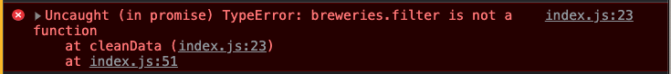
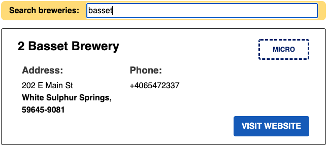
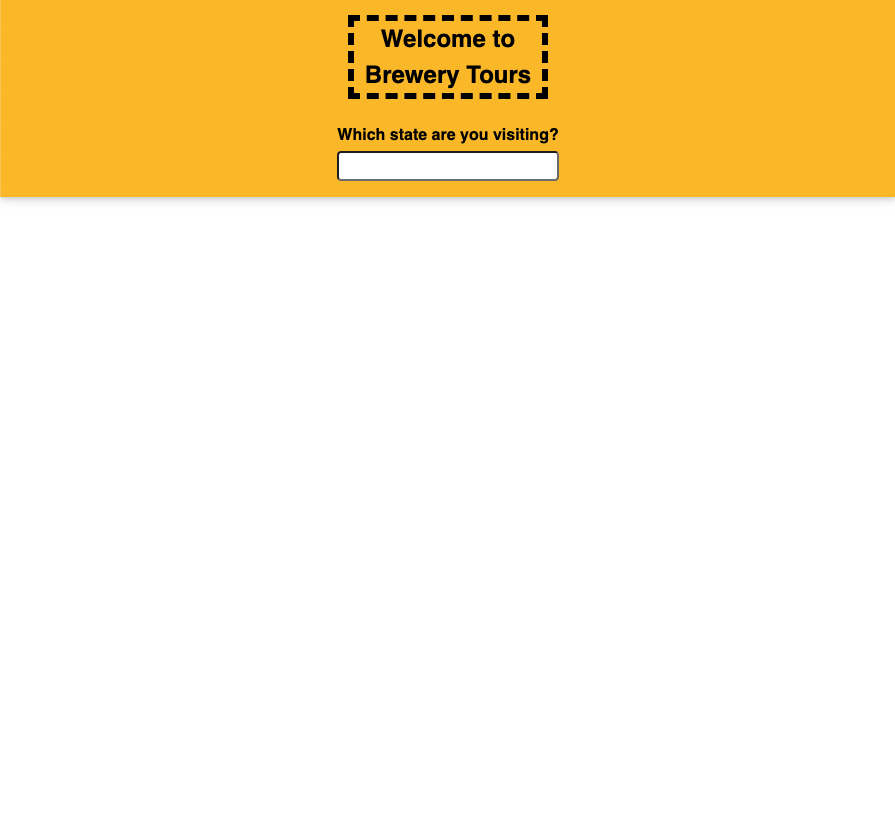
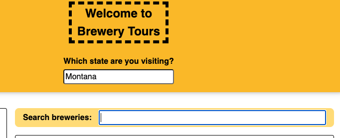
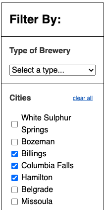

# Debugging Approaches

> All great debuggers are great programmers, but not all programmers are great debuggers.

## Objectives

* Get visibility using `console.log()`
* Use a methodical approach to get visibility on a complex program

### Bug 1
Nothing is happening when I search for breweries in the state of Montana!

To replicate: type the name of a state into the state search bar and press enter.

Expected behaviour: A list of breweries show on the page

### Bug 2
I see the word `undefined` in the list of breweries searchbar

To replicate: type the name of a state into the search bar and press enter.

Expected behaviour: No `undefined` in the searchbar

### Bug 3
When I try to narrow down my search for a Brewery, it works, but when I hit enter, the whole page disappears!

To replicate:
- type the name of a state into the state search bar and press enter.
- type the name of a brewery into the breweries search bar and press enter.

Expected behaviour: The whole page shouldn't disappear when pressing enter

Before

After

### Bug 4
The title is missing from above the breweries searchbar

To replicate:
- type the name of a state into the state search bar and press enter.

Expected behaviour: The title should render above the searchbar

### Bug 5
When I select some cities using the checkboxes, and then try to deselect one, all of my selections are deselected.

To replicate:
- type the name of a state into the state search bar and press enter.
- select two or more cities by checking their check boxes
- deselect a city by unchecking one of the check boxes

Expected behaviour: Deselecting should only affect the city being deselected, not others

